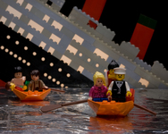
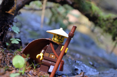
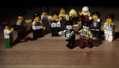

On Screen | Postit | The point |Key
----------|--------|-----------|---
||Setup - no mimes|
Opening slide || We thought we could knock it but we can't
|| It rocks, go back and read it|
The new plan | | question criticize and iterate|
 || Doctrinal purists are still invited to be appalled.|
 | 2001 | scene setting|
 || A world before Minecraft|
 | Apocrypha | some things around at the time|
 |SCRUM 15||
||stupid name|
 |XP 2||
 |The Psychology of Computer Programming 30||
 |The Cathedral and the Bazaar 4||
 |Individuals and interactions over processes and tools| The mainstreaming of geek culture|
  | individuals vs industrialised process | |
  | | cult of the rockstar
  | team member - slave - individual ||
  | Bob Fett - Not a Team Player | rockstars are poison to teams|
  | external consultants are poison to teams ||
 |3 front-end devs, 2 back-end and a delivery manager please|A team is not a collection of individuals.|
  |inter-disciplinary| team ethos|
  |No Blockers| reportage in scrum heresy|
  |Get Stickier PostIts| postit heresy|
  |Team interactions over processes and tools| |
  |Working software over comprehensive documentation| |
  | No Docs! ||
  | Good test coverage! ||
  | Working-ness | |
  | Laziness | Rupert is guilty as hell |
 || reaction against up-front specification | 
| Working Software | sockets without plugs and failed experiments |
 |A client for an imaginary API||
 |Discarded Experiments||
 |*Useful* software over comprehensive documentation|| 
 |*Useful* software *before* comprehensive documentation|Remove the hiding place of laziness|
 | Customer collaboration over contract negotiation ||
 |Customer||
 |User||
 |Team||
 |||
 |collaborative delivery over contract negotiation||
|Responding to change over following a plan||
||The no-plan heresy|
||The user story with acceptance criteria|
 |User Story Conversations||
 |Acceptance Criteria|The arrival of prescription|
 |Development||
 |Testing||
 |Fail!||
|Envisioning the End State|
|a little waterfall||
|a little water-fall||
 |organization by specialization||
 |Imagine|Free the tester - interdisciplinary teams|
|Manifesto||
 |Perpetual Revolution|Constantly challenge power relationships|
 |Kaizen Revolution|root out oldthink|
 |Continuous change over following a plan||
||The end of a journey of sorts|
 |Team interactions over processes and tools||
 |Useful software _before_ comprehensive documentation||
 |Collaborative delivery over contract negotiation||
 |The user line?||
 |Continuous change over following a plan||
 | RETAIN HUMANITY | remember all the people |
 |DISTRIBUTE POWER|Don't reposition it|
||Strive for balance|
 ||BOOM|
|@harryharrold & @rupertredington @neontribe||

  
