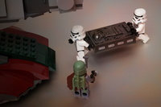

On Screen | Postit | The point
----------|--------|----------
Opening slide || We thought we could knock it but we can't
|| It rocks, go back and read it
The new plan | | question criticize and iterate
 || Doctrinal purists are still invited to be appalled.
 | 2001 | scene setting
 || A world before Minecraft
 | Apocrypha | some things around at the time
 |SCRUM 15|
Overlay: Picture of a scrum||
 |XP 2|
 |The Psychology of Computer Programming 30|
 |The Cathedral and the Bazaar 4|
 |Individuals and interactions over processes and tools| The mainstreaming of geek culture
  | individuals vs industrialised process | 
  | | cult of the rockstar
  | team member - slave - individual |
  | Bob Fett - Not a Team Player | rockstars are poison to teams
  | external consultants are poison to teams |
 |3 front-end devs, 2 back-end and a delivery manager please|A team is not a collection of individuals.
  |inter-disciplinary| team ethos
  |No Blockers| reportage in scrum heresy
  |Get Stickier PostIts| postit heresy
  |Team interactions over processes and tools| 
  
